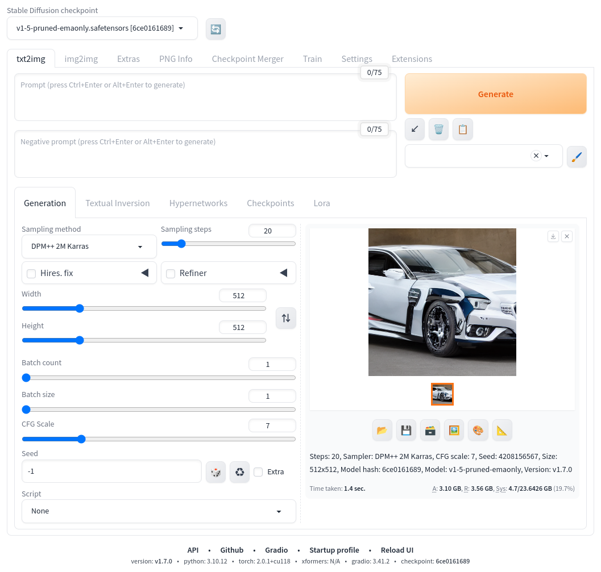
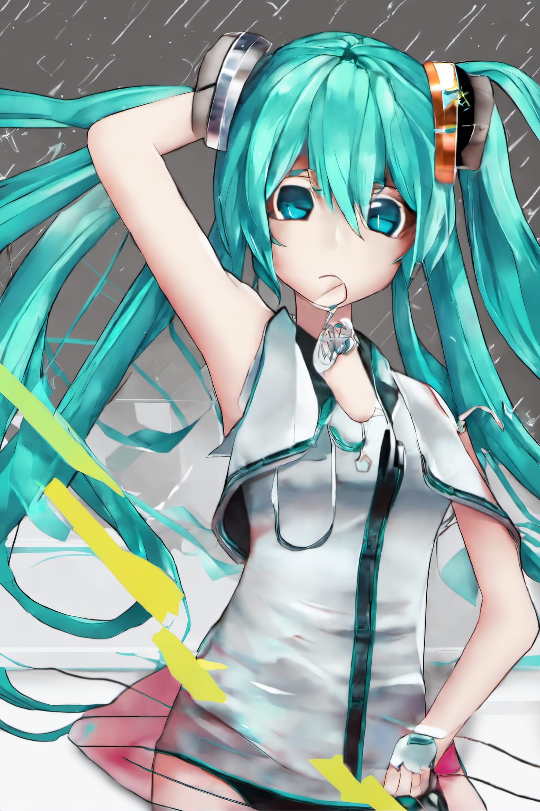

# stable-diffusion-webui 導入 (v1.7.0)
stable diffusion を実行する上で便利なツールである、[AUTOMATIC1111/stable-diffusion-webui](https://github.com/AUTOMATIC1111/stable-diffusion-webui)の導入について記載する。

なお、筆記時点の構築確認環境はUbuntu22.04である。

## 初期構築
Linuxの場合は[シェル](https://github.com/AUTOMATIC1111/stable-diffusion-webui?tab=readme-ov-file#automatic-installation-on-linux)が用意されているので利用すると簡単。  
wgetしたwebui.shは以降起動シェルとしても利用できる。
```
# Debian-based
sudo apt install wget git python3 python3-venv libgl1 libglib2.0-0
wget -q https://raw.githubusercontent.com/AUTOMATIC1111/stable-diffusion-webui/master/webui.sh
chmod 755 webui.sh
./webui.sh
```

webui.sh実行後にブラウザから利用できるようになるため、
Stable Diffusion checkpointを選び、Generateを押すと何かしらの絵が得られ、outputs以下に保存される。  
デフォルトだとSD1.5のモデルが利用できる。


### No module 'xformers'. Proceeding without it.
下記のようにしてxformersを利用するパラメータを加えれば良い([参考](https://github.com/AUTOMATIC1111/stable-diffusion-webui/discussions/5303#discussioncomment-6423824))。  
生成結果が多少変わるが、基本的には有効化しておいたほうが省メモリ化(5〜10%)＋高速化(20〜30%)されるので大抵有効化しておくと良い。  
```
./webui.sh --xformers
```

webui-user.sh を下記のように作成して webui.shと同じディレクトリに入れておくとパラメータを読み取ってくれる
```
export COMMANDLINE_ARGS="--xformers"
```

## Extensions
拡張機能を追加する。

1. Extensionsに移動
1. Install from URLに移動
1. installしたい拡張機能のgit repository URLをURL for extension's git repositoryに入力してInstallをクリック
    - ControlNet for Stable Diffusion WebUI
        - https://github.com/Mikubill/sd-webui-controlnet
        - openposeとか組み合わせるためのプログラム
    - LyCORIS
        - https://github.com/KohakuBlueleaf/LyCORIS
        - 強化版Lora
    - ADetailer
        - https://github.com/Bing-su/adetailer.git
        - 部分修正
    - Photopea
        - https://github.com/yankooliveira/sd-webui-photopea-embed
        - 画像編集ソフト（再保存してメタデータを削除するなど）
1. Apply and restart UI を押して有効化する

## Settings
自分が利用しやすいように必要に応じて設定変更する。

### VAEの上書き切り替えとを表示
1. Settingsに移動
1. User interfaceに移動
1. Quicksettings list に下記を追加（デフォルトはsd_model_checkpointのみ）
    - sd_vae
    - CLIP_stop_at_last_layers
1. Apply settingsをクリック
1. ページを再読込すると上部に表示されるようになる
    - デフォルトはAutomatic
    - Noneを指定すると、モデルに内蔵されているVAEが利用される
    - VAEをモデルに内包したものも多いので、設定しなくても十分機能することも多い

### 保存名を「保存時刻-seed」に変更
1. Settingsに移動
1. Saving images/gridsに移動
1. Images filename patternを次のように書き換える
    - [datetime<%Y%m%d-%H%M%S-%f><Asia/Tokyo>]-[seed]
1. Add number to filename when saving のチェックを外す
1. Apply settingsをクリック

### jpgの生成閾値変更

1. Settingsに移動
1. Saving images/gridsに移動
1. File size limit for the above option, MBを4から変更する
    - もしくは Save copy of large images as JPG のチェックを外すと生成されなくなる

## モデル導入
SDXL用のモデルを中心に組み込んでいく。    

| 種類             | 配布元                                                                                                                                          | 保存先                   | 備考                       |
| ---------------- | ----------------------------------------------------------------------------------------------------------------------------------------------- | ------------------------ | -------------------------- |
| Baseモデル       | [stable-diffusion-xl-base-1.0](https://huggingface.co/stabilityai/stable-diffusion-xl-base-1.0/tree/main?_fsi=3kT7R9AB)                         | /models/Stable-diffusion |                            |
| Baseモデル       | [CounterfeitXL](https://civitai.com/models/118406?modelVersionId=265012)                                                                        | /models/Stable-diffusion |                            |
| Baseモデル       | [Animagine XL V3](https://civitai.com/models/260267)                                                                                            | /models/Stable-diffusion |                            |
| Refinerモデル    | [sd_xl_refiner_1.0](https://huggingface.co/stabilityai/stable-diffusion-xl-refiner-1.0/tree/main?_fsi=3kT7R9AB&_fsi=3kT7R9AB)                   | /models/Stable-diffusion |                            |
| VAE              | [sdxl_vae](https://huggingface.co/stabilityai/sdxl-vae/tree/main?_fsi=3kT7R9AB)                                                                 | /models/VAE              |                            |
| Upscaler         | [4x-Ultrasharp](https://civitai.com/models/116225/4x-ultrasharp)                                                                                | /models/ESRGAN           |                            |
| Lora             | [sdxl-flat](https://huggingface.co/2vXpSwA7/iroiro-lora/blob/main/sdxl/sdxl-flat.safetensors)                                                   | /models/Lora             |                            |
| LyCORIS          | [Neg4All_XL](https://civitai.com/models/116480/sdxl10neg4allxlboth-positive-high-qualitydetails-and-negative-worse-qualitybad-hand-in-one-lora) | /models/LyCORIS          | 保存先がない場合作成する   |
| ControlNetモデル | [lllyasviel/sd_control_collection ](https://huggingface.co/lllyasviel/sd_control_collection/tree/main)                                          | /models/ControlNet       | 必要に応じてモデルを入れる |
| ControlNetモデル | [bdsqlsz/qinglong_controlnet-lllite](https://huggingface.co/bdsqlsz/qinglong_controlnet-lllite/tree/main)                                       | /models/ControlNet       | 必要に応じてモデルを入れる |
| Emmbedings       | [negativeXL](https://civitai.com/models/118418/negativexl)                                                                                      | /embeddings              |                            |

## 動作確認
初音ミクをパラメータを変えながらいくつか生成してみる。  
パラメータ詳細は画像に埋めてあるのでここでは割愛。  


