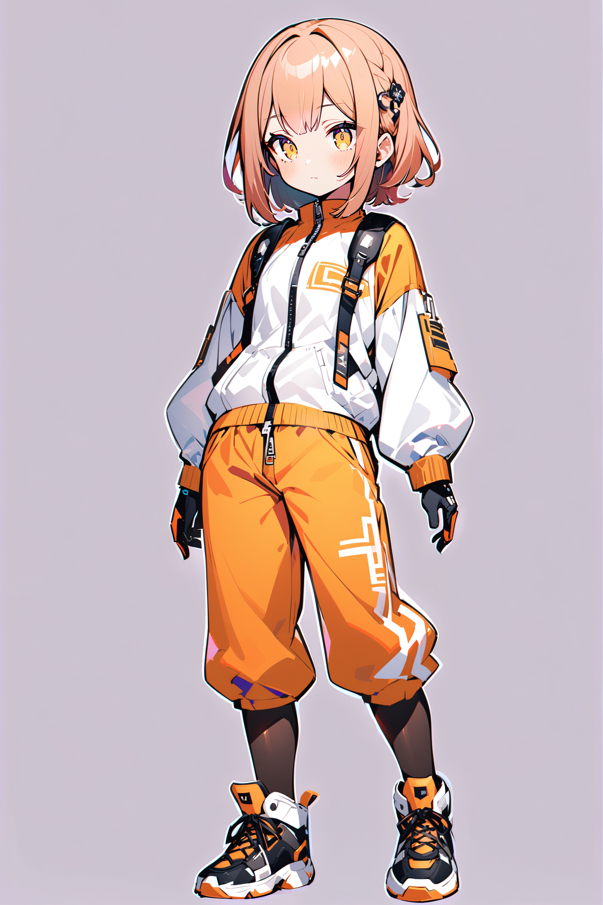
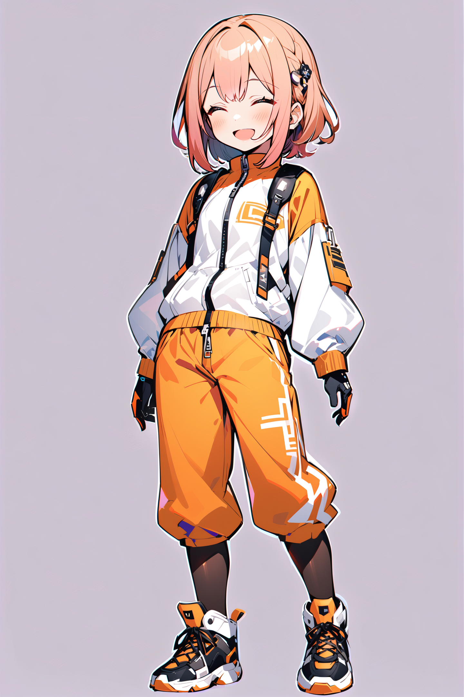
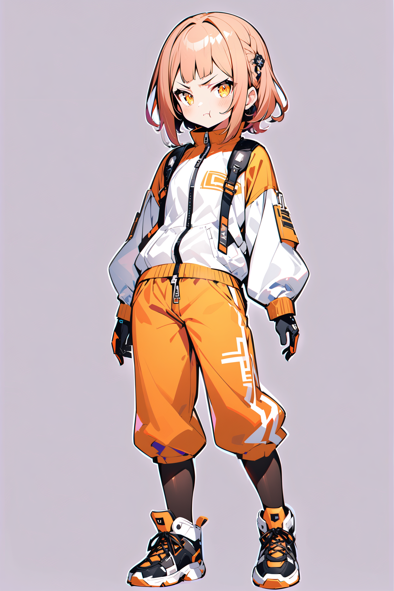
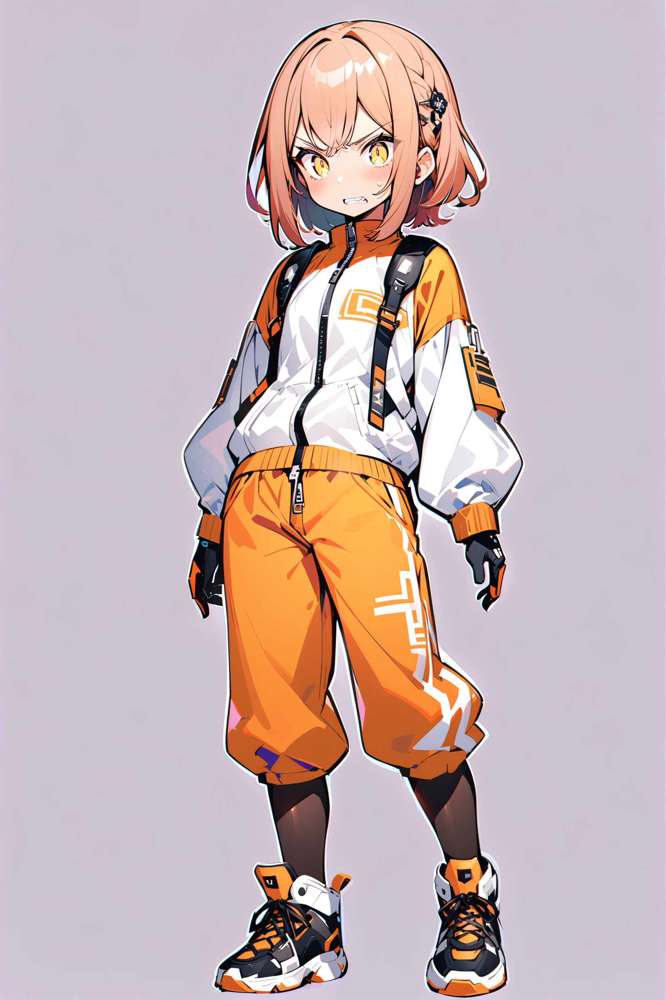
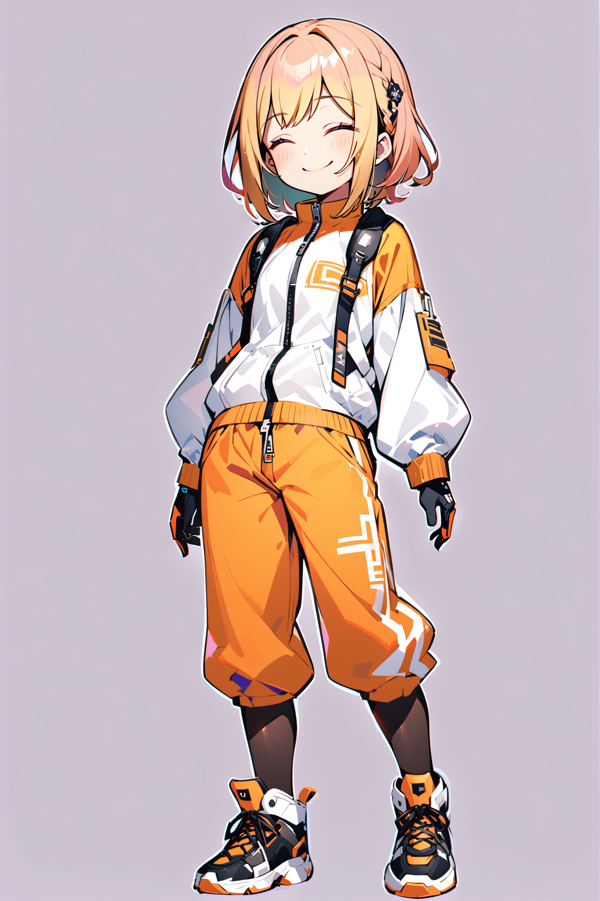
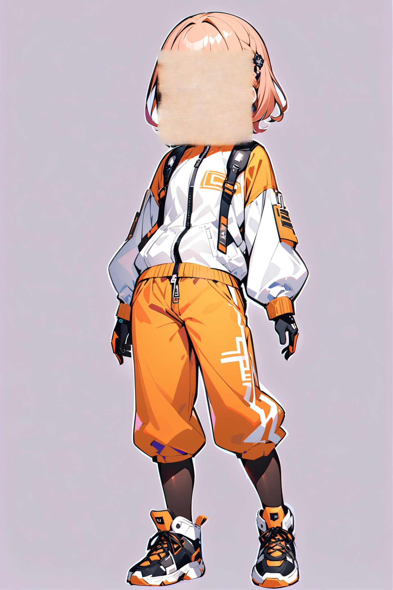

# ADetailerによるキャラクター表情操作
[ADetailer](https://github.com/Bing-su/adetailer)を用いてキャラクター立ち絵の画像の表情差分を生成してみる。

## ADetailer
再描画領域を自動して、画像を再計算した後に結果をなじませる技術。  
人物画像の顔修正に利用するパターンが多い。  
下記の動画が詳しく解説している。  

<iframe width="560" height="315" src="https://www.youtube.com/embed/sF3POwPUWCE?si=fF2KRFtsaKbAWGMs" title="YouTube video player" frameborder="0" allow="accelerometer; autoplay; clipboard-write; encrypted-media; gyroscope; picture-in-picture; web-share" allowfullscreen></iframe>

<iframe width="560" height="315" src="https://www.youtube.com/embed/urNISRdbIEg?si=WMPVjyvbLmgDaxzi" title="YouTube video player" frameborder="0" allow="accelerometer; autoplay; clipboard-write; encrypted-media; gyroscope; picture-in-picture; web-share" allowfullscreen></iframe>

## ベースにする画像

## 設定
face_yolov8n.pt モデルを利用し顔を検出しつつ、下記のようにパラメータ調節する。

| パラメータ                 | デフォルト値 | 設定例    | 備考                                                                                                       |
| -------------------------- | ------------ | --------- | ---------------------------------------------------------------------------------------------------------- |
| Inpaint denoising strength | 0.4          | 0.4 〜 0.7 | 低すぎると変化が見えない。 高くなりすぎるとバランスが崩れる。 なるべく固定したほうが差分絵らしくなる |
| Inpaint mask blur          | 4            | 4 〜 18    | 数値を上げるとなじませるための領域が広がる。                                                               |

## 生成例

### 失敗例
| 髪の色が変わりすぎる                                                           | そもそも顔にならない                                                           |
| ------------------------------------------------------------------------------ | ------------------------------------------------------------------------------ |
|  |  |

### 所感
- 顔部分が置き換えになるので目の色や髪の色など顔に関係するプロンプトはセットで渡してしまったほうが良さそう。
    - ベース画像の時点で指示できている方が生成結果がぶれないと思われる。
- angryとか\^∀\^ みたいなやつがなかなか作りにくい。
    - 笑顔は[SD1.5だと補正Lora](https://civitai.com/models/156650/smiling-face-helper)があるのでLora欲しい。
- Inpaint denoising strength は全体的に影響が出るので、なるべく早い段階で固定したほうが差分絵らしくなる。
- 違和感の解消などの微調整でそこそこ試行錯誤した。
    - ComfyUIのようにバッチ的に生成してから選択したほうが筋が良いかも
- リアル調はパラメータを工夫しないと別人になりそうな気もする。
