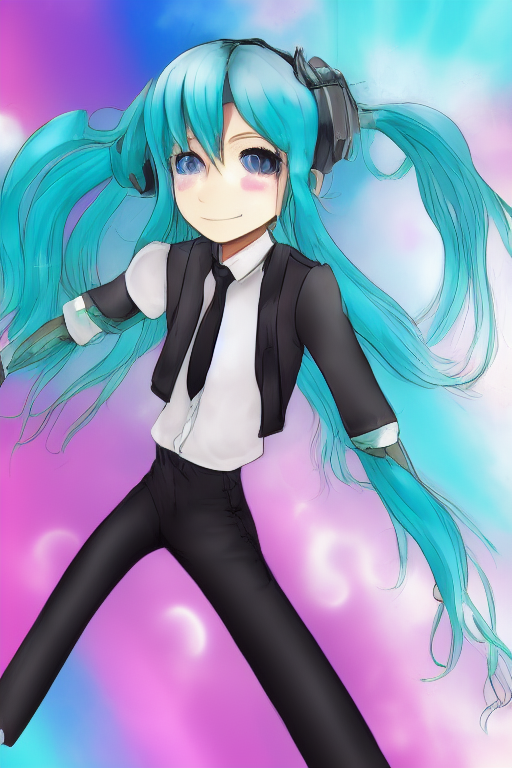
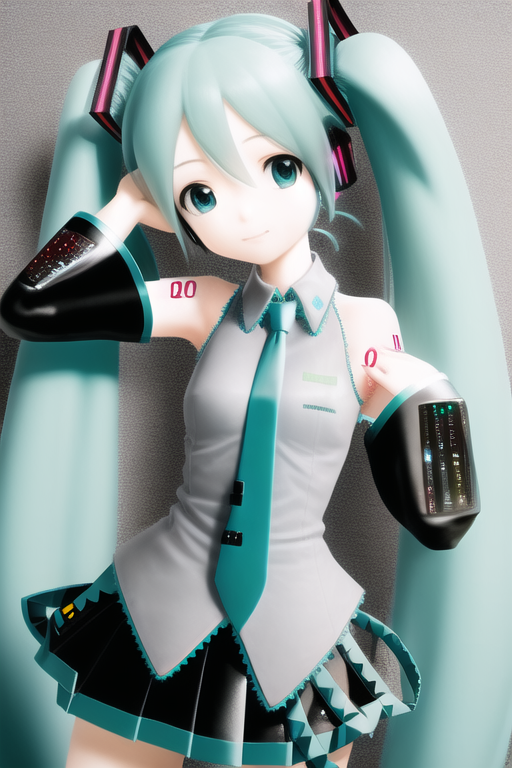
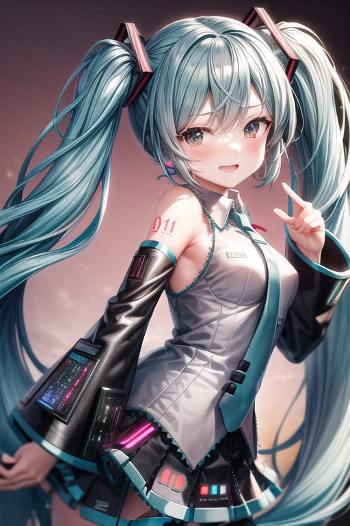

# 【SD1.5】初音ミク画像生成ベンチマーク
Diffusion Modelによる画像生成では下記のような要素を変更することで、簡単に生成結果を大きく変化させることができる。

- モデル, VAE（Variational Autoencoder）
- 追加学習（Textual Inversion）
- 追加学習（LoRA）

ここでは「初音ミク」を生成対象とし、要素を変えながらいくつか画像生成を行った結果を掲載する。

## 利用するもの一覧
- 描画対象
    - 初音ミク（hatsune miku）
- モデル, VAE
    - sd-v1-4
    - AOM3, oramgemix.vae
- 追加学習（Textual Inversion）
    - EasyNegative
    - bad-hands-5
- 追加学習（LoRA）
    - flat

## 生成方法
| 番号 | Model, VAE | 追加学習（Textual Inversion） | 追加学習（LoRA）|
| - | - | - | - |
| 結果1 | sd-v1-4 | - | - |
| 結果2 | AOM3, oramgemix.vae | - | - |
| 結果3 | AOM3, oramgemix.vae | EasyNegative | - |
| 結果4 | AOM3, oramgemix.vae | EasyNegative, bad-hands-5 | flat |

## 生成結果



### 結果1

```
hatsune miku
Steps: 20, Sampler: Euler a, CFG scale: 7, Seed: 3272356495, Size: 512x768, Model hash: fe4efff1e1, Model: sd-v1-4, Clip skip: 2
```

### 結果2

```
hatsune miku
Steps: 20, Sampler: Euler a, CFG scale: 7, Seed: 1477562008, Size: 512x768, Model hash: d124fc18f0, Model: AOM3, Clip skip: 2
```
### 結果3

```
hatsune miku
Negative prompt: EasyNegative
Steps: 30, Sampler: DPM++ 2M Karras, CFG scale: 7, Seed: 534580541, Size: 512x768, Model hash: d124fc18f0, Model: AOM3, Clip skip: 2
```
### 結果4

```
<lora:flat2:-1>, hatsune miku
Negative prompt: EasyNegative, bad-hands-5
Steps: 30, Sampler: DPM++ 2M Karras, CFG scale: 7, Seed: 673866072, Size: 512x768, Model hash: d124fc18f0, Model: AOM3, Clip skip: 2
```

## クレジット
これらのAI画像の作品は<a href="https://piapro.jp/license/pcl/summary">ピアプロ・キャラクター・ライセンス</a>に基づいてクリプトン・フューチャー・メディア株式会社のキャラクター「初音ミク」を描いたものである。