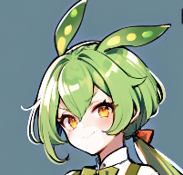
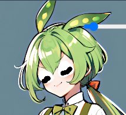
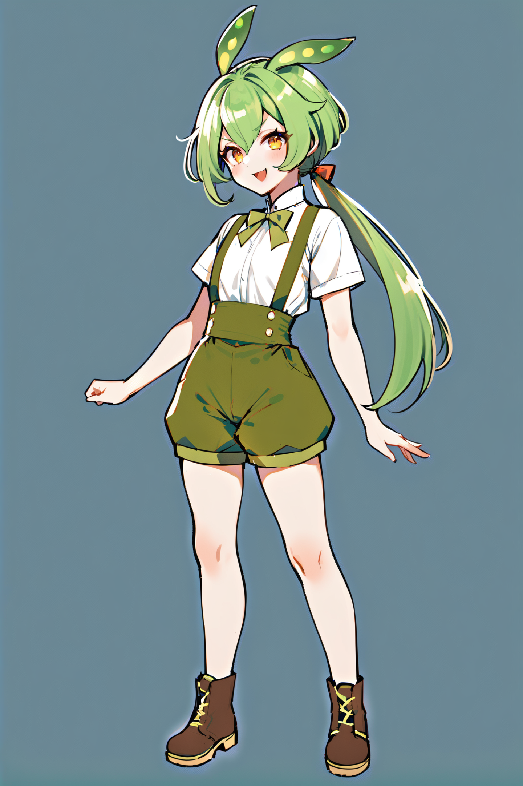
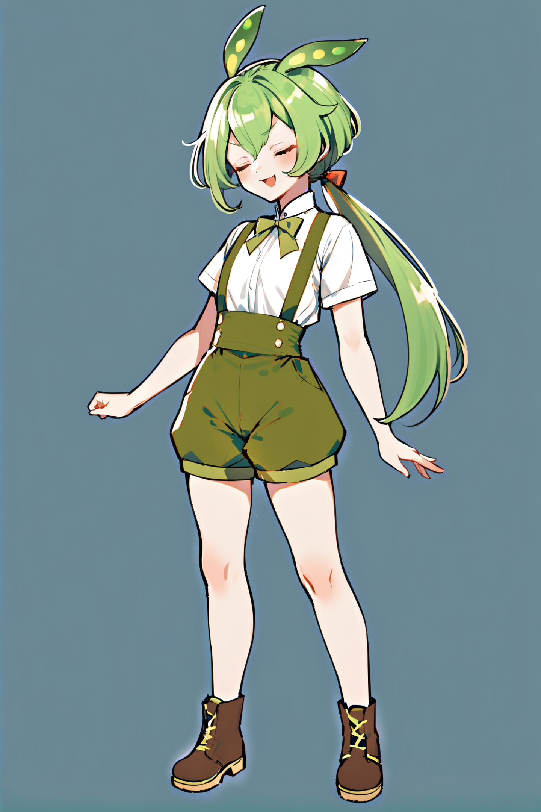
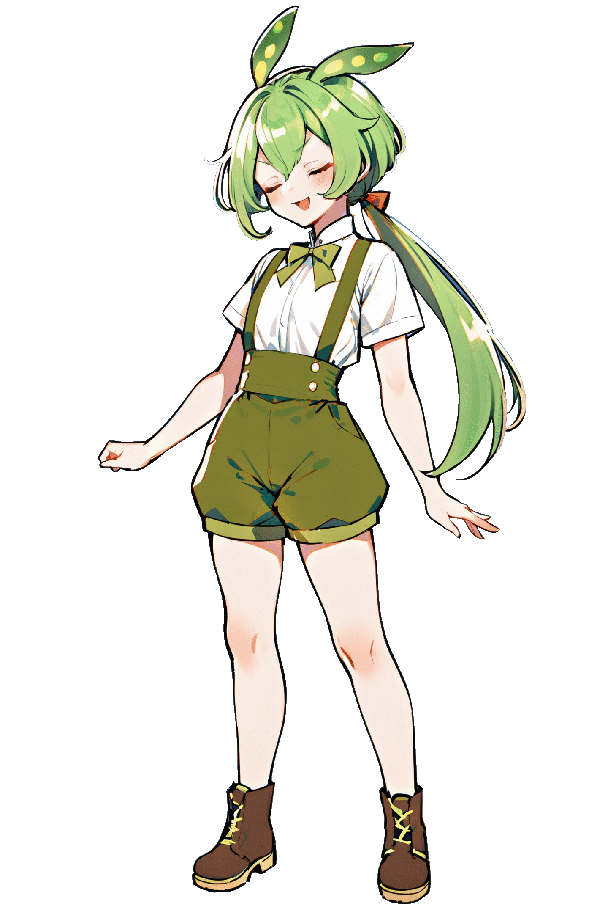

# i2iでの顔アニメーションの作成
i2iで構図を変えずに画像を修正できる。  
応用して顔アニメーションする立ち絵を作成してみる。

## ベース画像
animagine + zundalora で適当に全身絵を出力


## 差分作成
口はInpaintで口周辺を塗りつぶし(白っぽくなっている領域)。  



閉じた目は単純にclosed eyesで指定すると眉毛に引っ張られるのかまぶたの位置が高くなりすぎるので、Inpaint sketchでラフに手書き。



i2iを掛けて画像生成。  
Seed値はベース画像を作成したものと同じものを設定し、Denoising strengthは破綻しない程度に数値調整していく。  
目を閉じて口を開けている画像は、目を閉じて画像から口を閉じた画像を生成して作成。


## アニメーション作成
transparent-backgroundで透過してImageMagick（convertコマンド）で適当につないでみる。

```
# srcにある画像を透過
transparent-background --source src --dest dst
# dstにある画像まとめて動画にする
convert -delay 20 -loop 0 ./dst/*.png out.gif
```



## 所感
- 単純に4枚作成して適当につないでみたが、なかなかいい感じ。細かいとこ見るとちょっと荒い。
- 手動作業多めなのでちょっとめんどくさい
- 目、口、前髪あたりをレイヤ別生成していい感じにパターンつくるプラグインかスクリプトを作れると便利かも