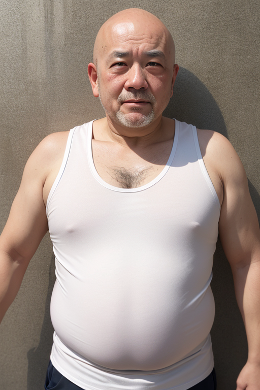

# SadTalkerでの顔アニメーションの作成
[SadTalker](https://sadtalker.github.io/)で一枚の人物画像と音声ファイルで動画作成できる。  
stable diffusion webuiにプラグインがあるので利用してみる。  

## ベース画像
以前作ったおっさん画像を転用。

## 音声
[VOICEVOX](https://voicevox.hiroshiba.jp/)で適当に作成。

<audio src="./07-benchmark-sadtalker-face-animation/001_麒ヶ島宗麟（ノーマル）_コロナウイルスには….wav" controls></audio>

## sadtalker
stable diffusion webuiにプラグインがあるのでインストールする。

https://github.com/OpenTalker/SadTalker

モデルはここに公開されているものをダウンロードして`extension/SadTalker/checkpoints`に配置。

https://drive.google.com/drive/folders/1hgPt7dx4bCi74u_R24Eaapt6QeCHuVb_

## 生成実行
- face model resolution は 256 で設定
- Still Mode を有効化してあまり動かさないようにする
- GPFGAN as Face enhancer を有効化にする

<video controls playsinline width="35%" autoplay loop muted="true" src="./07-benchmark-sadtalker-face-animation/movie0.mp4" type="video/mp4" style="vertical-align:middle;"></video><video controls playsinline width="50%" autoplay loop muted="true" src="./07-benchmark-sadtalker-face-animation/movie1.mp4" type="video/mp4" style="vertical-align:middle;"></video>

## 所感 
- 画像一枚と音声ファイルで簡単にディープフェイクが作れつつある
    - ボイスチェンジャー系の技術と組み合わせるとフェイク動画になりそう
    - [VALL-E X](https://arxiv.org/abs/2303.03926)あたりが面白そう
- 画像を無理やり動かしている感も残っているが上々。
- 全身のモーションまで補完できるようになるなら顔ハメ感減りそう。
- フォトリアル系ではよく機能するものの、イラスト系はあまり機能しなかった。
    - 顔が検出できなかったり、イラスト調の補完にならなかったりする。